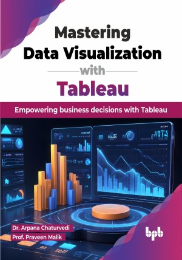

# Mastering Data Visualization with Tableau

Transform your data into decisions: Unlocking the strategic potential of visual analytics

This is the repository for [Mastering Data Visualization with Tableau
](https://bpbonline.com/products/mastering-data-visualization-with-tableau?variant=43877504745672),published by BPB Publications.

## About the Book
"Mastering Data Visualization with Tableau” is an invaluable book that will help you become more knowledgeable and elevate your understanding and skills in data visualization using Tableau which is one of the leading tools in the industry. This comprehensive resource covers the basics of visual analytics, explaining both the theory and practical ways to turn raw data into useful insights.

You will start with Tableau Desktop by learning to download it, navigate the interface, and connect to data sources. The book teaches you to create and format basic charts, adding interactivity with parameters, sets, sorting, and filtering. You will explore calculations and advanced visualizations like bar-in-bar charts and maps. It covers designing interactive dashboards, using text and images for storytelling, and sharing work via PDFs and Tableau Public. The book ends with AI features in Tableau and hands-on exercises to practice.

Through this book, readers can gain the confidence to handle complex datasets, apply advanced visualization techniques, and harness Tableau's full potential to make informed decisions faster and with greater accuracy. This guide is your pathway to becoming proficient in the art and science of data visualization with Tableau. 

## What You Will Learn
• Tableau for complex data visualizations and apply predictive analytics. Clean and prepare data efficiently and create interactive dashboards that drive strategic business decisions.

• Advanced charts like bar-in-bar, profit calendar, and map visualizations.

• Gain practical hands-on experience with a question bank based on various industry use cases, enhancing your ability to tackle real-world data challenges.
